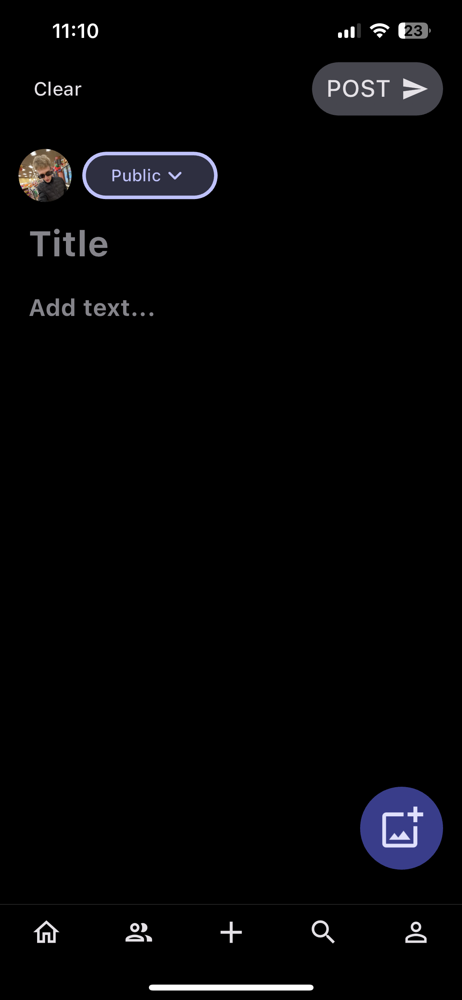
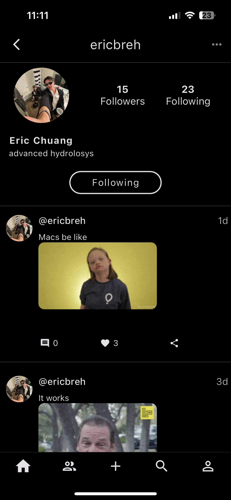

# Social Media App
Twitter-like social media app created with Flutter.

### Authors
* [Eliah Reeves](https://github.com/nunibye)
* [Christian Knab](https://github.com/christianknab)
* [Eric Chuang](https://github.com/ericbreh)

### Contact us
To contact us reach us at conetechnologiesdev@gmail.com!

## Table of Contents
* [General Info](#general-info)
* [Technologies](#technologies)
* [Overview](#overview)

## General Info
We wanted to create an app that functions similar to X (twitter) or Threads. We are currently in development of the app, adding new functionalities, patching bugs, and improving on the user experience every week! The app is in beta on Test Flight and have over 30 current users.

## Technologies

### Firestore Database
JSON database stores all posts and user data in documents organized in subcollections.

### Firebase Cloud Storage
Stores profile pictures.

### Firebase Auth
The authentication service for our users.

### Firebase Functions
Using Go and JavaScript to listen and react to changes to the database.

### Firebase Cloud Messaging
Service to send notifications to devices, based on writes to the database.

### Algolia Search API
Service to search user names and usernames.

### Giphy API
Integrated to add Gifs to posts.

## Overview
Here is an example of the current pages in their state as of Decemeber. 

#### Feed
Here is the Feed. You can choose a filter and scroll through their respective posts. You can comment, like, and even share a post with a link.

#### Groups
The Groups page are similiar to group chats, where you can make posts to people you select.

#### Compose
The page to write a post. Click the +image button to add a gif from Giphy.

#### Search
You can search for any user.

#### Profile Page
A page for your or another user's profile. Can view their followers and following.

