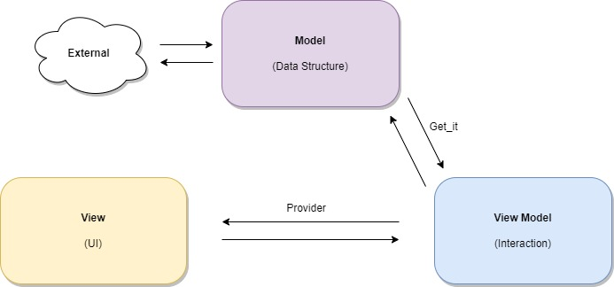
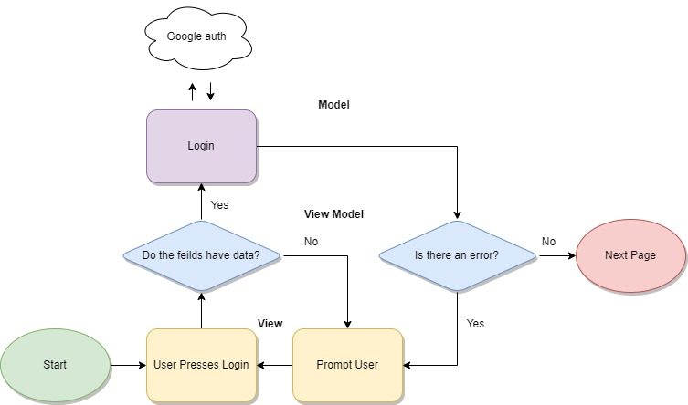
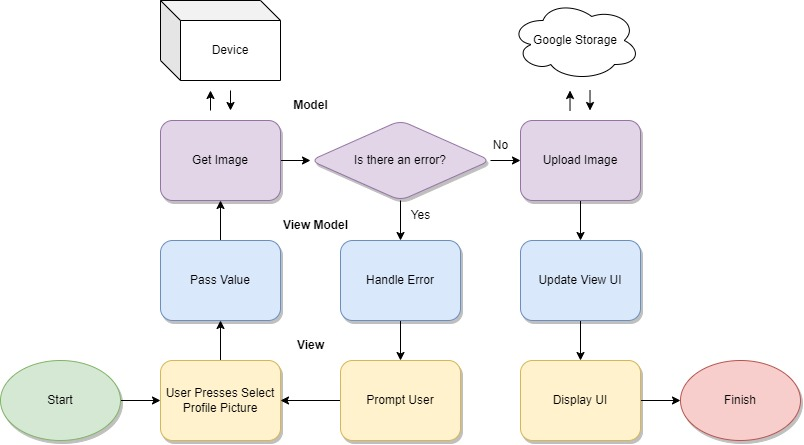

# Untitled
***
## Plan
### Idea
Social media app similar to twitter, needs something to make it unique.
Possibilites:
 * Users are required to post before they can see other posts.
 * Users can't delete or edit posts
 * App has a "daily question" in case the user can't think of something to post.
### Name
Ideas for an app name:
 * GC -GroupChat
 ***
## Features
### Required
 * Posts
    * Likes
    * Comments
    * Option to tag people
 * Clean Sign in and Sign up
 * Profile
    * Profile picture
    * Followers (viewable)
    * Following (viewable)
    * Display posts or some content
 * Settings
    * Acount control (delete account, reset password, change email)
    * maybe theme, language
 * Some kind of feed/explore
### Optional
 * Direct message
 * Some kind of discord-ish type communities or maybe post tags.
    
***
## Architecture



This app will use MVVM  architecture. This is a standard architecture layout and lots of information can be found online. MVVM aims to divide an app into two parts with a layer in between. The two parts are called the view and the model, with their intermidiate layer being the view model. The advantage of dividing the app up like this is that it creates separation and modularization, making it easier to debug and reuse code. Having separate parts makes each layer independent of the others so that the layers can be tested individually. Writing code with these layer forces programming techniques we didn't relly have to explore previously, but after some getting used to I find it just as easy and fast as the way we used to write.

### Overview
#### 1\) View

All of the UI is exclusively in the View. The view is prohibited from knowing about the model. All view communication must be through the view model. The view should be a stupid ui, it is not allowed to have any code. 

#### 2\) View Model

The view model is the communication between the view and the model. If the view wants to display data it must request it from the view model which in turn will request it from the model. Any control over the UI should be done from here. If a button is pressed in the UI it will call a method here. All variables related to the UI should also be here. An example is the login page. The view model has a variable called loggingIn that controls if the spinning indicator shows.

#### 3\) Model

Model houses the main data model. It will hold data in the most basic form and do all of the business logic. Data in the model should be processed by the view model before it has handed to the view. Just as the view is not allowed to know about the model, the model is not allowed to know about the view. The model also is responsible for business logic. Any processing of data that doesn't get directly passed to the UI should be here. For example read/write to storage or database should be here.
#### Login Program Example

#### Change Profile Picture Example

### Implementation

This architecture pattern is very common and useful because of that many platforms force you to use it. Flutter is not one of these. Flutter was made to be highly flexible and not enforce one architecture. Because of this, it doesn't have all the tools needed to implement this design, or at least not implement it easily. To augment the Flutter framework we use two packages, provider and get_it. Provider is a state management tool that we can use to detect state changes and re-use the same object in different parts of the code. Get_it is a service locator. We use it to globally register objects so that any part of our code can look inside the global object and retrieve data. 

#### How do these packages affect our code?

This section will be divided into halves, one for View and the other for Model. Since the view model is intertwined with both it will be talked about at the end of each section.

#### View

 The big change in view is that we don't need to manage the state anymore. In the past, we used stateful widgets for most things because they manage their state internally. This allowed us to use calls to setState that would rebuild the widget tree. We don't need this anymore. Our state is handled by instances of providers from the view model. The provider tells the view exactly what to rebuild so that way view doesn't need to worry about its taste any more. This means that all widgets should be stateless to save memory. I wouldn't say this is a hard and fast rule if you need to use a stateful widget for something fine, but using setState is prohibited since that will pollute the View with logic code. An implementation of the provider into view will look like this:

1\) Where do you need a provider? Think about what elements of View will need data from a particular view model.

Wrap all of the code where you might need data from the controller in a ChangeNotifierProvider widget. This will be accessible from all widgets below the place you put it. It will not affect performance if this is placed too high in the widget tree. 

I don't know if this is true:
*Problems can arise if a widget tries to access a provider above the closest provider to it. Widgets will search for the closest provider only. If access to two different providers is needed in the same branch move the providers together and use a multi-provider.*

The ChangeNotifierProvider will look like this:

```dart
@override
Widget build(BuildContext context) {
    return ChangeNotifierProvider(
        create: (context) => ViewModelClass(),  //change this
        builder: (context, child) {
          return const PlaceHolder() // replace with normal widget tree
          
        }
    );
}
```

Now that we have an instance of our provider in the widget tree we need to interact with it. The best way to do this is with Consumer. The Consumer widget is great it knows exactly what to rebuild. In this way, provider is superior to setState because it doesn't rebuild too much. to use Consumer see below:

```dart
Consumer<ViewModelClass>(
    builder: (context, viewModelClass , _) => Text( //(context, name for a copy of the classs, optional: widget to not rebuild)
        viewModelClass.text
    ),
)
```

Consumers will only rebuild what is inside of it. Rebuilding does affect performance. Make sure that as little as possible is inside of this widget. One possibility is that your code will look like this:

```dart
Consumer<ViewModelClass>(
    builder: (context, viewModelClass , _) => SizedBox(
        width: viewModelClass.width,    //this only relates to SizedBox
        child: GiganticWidget(          //These get rebuilt for no reason (uses too much resources)
            child: MoreWidgets()
        )
    ),
)
```

In a case like this. You need to look at how to use the child parameter. This will allow an outer widget to be rebuilt without affecting the whole tree. It would look something like this: (note: I haven't tested using child so be careful)

```dart
Consumer<ViewModelClass>(
    builder: (context, viewModelClass , child){
        return SizedBox(
            width: viewModelClass.width,    //this only relates to SizedBox
            child: child,
        );
    }
    child: GiganticWifget(
        child: MoreWidgets()
    )   
)
```
With this code, we can rebuild just the part we need without using a bunch of resources to change the whole tree. Now that you know how to access the data from the view model class, you probably are wondering how to call the methods. You could just do it with the consumer because through the consumer you have full access to the object, but the cases you would do this are very rare, or even nonexistent because we don't want to rebuild the widget tree just to call a method. The proper way to call a method is with Provider.of as shown below:
```dart
IconButton(
    icon: Icon(
        icons.example
    )
    onPressed: () => 
        Provider.of<ViewModelClass>(context, listen: false)   //This calls our IconPressed method
                .IconPressed(),
)
```

When using this be sure that listen is set to false. If listen is set to true then the tree will be rebuilt. Setting listen to true can be used as an alternative to the consumer, but in many cases it will be less efficient because it will only allow you to access one parameter and it will sometimes rebuild more than necessary. it is good for simple operations at the ends of widget trees. This is all we need for view since it only needs to communicate with the view model. View doesn't need a way to talk to the model because it isn't allowed to.

#### How do we implement provider into view model?

View model will be a class with all the variables needed to control the view (remember these aren't variables for content just appearance). View is going to create a single instance of this class to use across all of the files and widgets controlled by the view model. To prepare view model for this we need to make it inherit from the flutter change notifier class. the implementation will look like this:
```dart
import 'package:flutter/material.dart';

class ViewModelClass extends ChangeNotifier{
    ...
}
```
Now we have access to the notifyListeners() method. Use this as you would use setState normally. Only call it when necessary because rebuilding widgets consumes resources. An example view model might look like this:
```dart
import 'package:flutter/material.dart';

class ViewModelClass extends ChangeNotifier{
    int count = 0;

    void incrementCount(){
        count++;
        notifyListeners();
    }
}
```
if a consumer is listening to this class it will rebuild when notify listeners is called.

One thing you may want to do is set a variable in the view model to a string, then take this string and display it in the app. The problem with this is we are using localization to display strings to provide translations in the future. We need to access the current local with context, which we don't have inside of our view model. Context is also required for navigation. My solution was to use a global navigator key. To get context see below.

```dart
import 'package:flutter/material.dart';
import 'package:untitled_app/navigation_service.dart';

class ViewModelClass extends ChangeNotifier{
    //make the name _context so it is private. (Underscore maters in names!)
    final BuildContext _context = NavigationService.navigatorKey.currentContext!;
    ...
}
```

#### Model

Model classes are the backbone of our app. it stores data so we don't need to request it every time the page changes. These classes are quite ordinary we don't need to do anything fancy in the code for the model. One thing to consider when designing your code is we can communicate with a model from a view model, but we can't detect changes. Change notifications must be sent through returned values (streams may also be an option for continuous data). A model class might look like the following:
```dart
class User{
    String username;
    String name;
    User({this.name = '', this.username = ''})
    //method to be called by view model
    Void GetProfileInfo() async {
        //code to talk to database

                        //notify caller when finished.
        return "done";  //Caller will then pull the data from the class.
    }
}
```

These Model classes store data that is crucial all over the app. It doesn't make sense to have a model for every page, instead, we make one for every group of data we will need, but how do we share our single instance of model among all of our view models? That is where get_it comes in.

Get_it is a service locator. We can register our models with it and then request them from it later anywhere we want without fear of the data changing. Get_it is fast (O(1)), so don't hesitate to use it. Also, it is worth mentioning that just because Get_it will allow us to access our models anywhere doesn't mean we should. By our own rules, we can't access the model from view.

How do I set up get_it?
There is a file called locator.dart. It currently looks like this:
```dart
import 'package:get_it/get_it.dart';
import './models/current_user.dart';

final locator = GetIt.instance;
void setupLocator() {
    locator.registerSingleton<CurrentUser>(CurrentUser());
}
```
The function setupLocator() is called in main. You can see that is registers the CurrentUser model. To register another model just add another line, locator.registerSingleton\<CurrentUser\>(CurrentUser());, to the setup function. The variable locator is defined in the global space so we can access it anywhere by importing locator.dart. Here is an example of a view model getting a variable out of a model.

```dart
import 'package:flutter/material.dart';
import '../locator.dart';   //get locator global
import '../models/current_user.dart';   //we stil need a class def

class ViewModelClass extends ChangeNotifier {
    final field = TextEditingController();  //used by view

    void updateTextField(){
        field.text = locator<CurrentUser>().email;  //pull a property from our class
    }
}
```
Accessing a method is very similar simply use
```dart
locator<CurrentUser>().method();
```
### Navigation //TODO

Navigating with this architecture is a little tricky. Currently I am just using the global key for context and using the normal pop and push. We should come up with a navigation plan and separate this drom our main files. I would like to use named routes so we can use Navigator.popUntil(), but I am unsure exactly how this would work